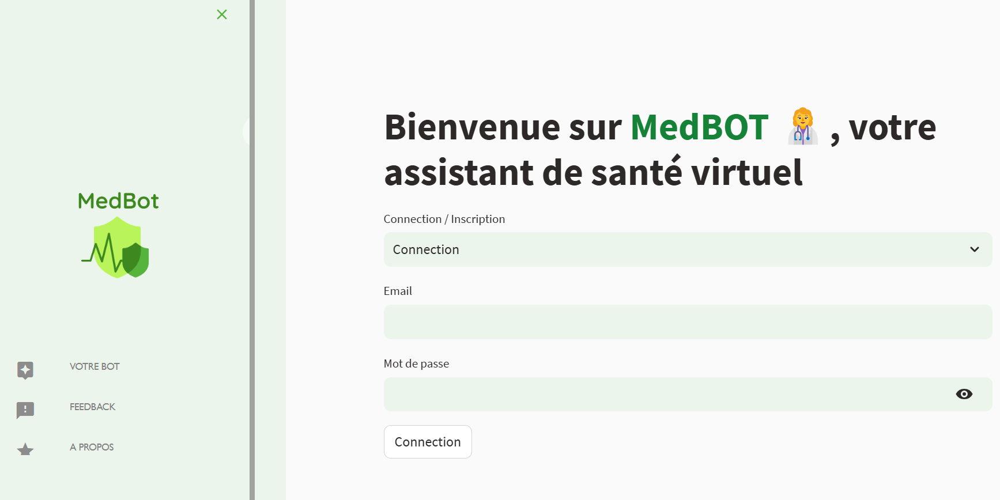

# 🏥 MedBot – Your AI Healthcare Assistant

 

MedBot is an intelligent conversational healthcare assistant built with **Streamlit**, **LangChain**, **OpenAI**, and **Firebase Firestore**. It helps users ask questions about medical conditions and receive accurate, friendly responses using real healthcare data from CSV files (Mayo Clinic datasets).

> 💬 Speak naturally, ask therapeutic or diagnostic questions, and get answers fast—all in French 🇫🇷!

---

## 🌐 Try It Live

👉 [Launch the App on Streamlit](https://medbot.streamlit.app) 

---

## 🔍 Features

✅ Conversational chatbot powered by **OpenAI GPT-3.5**  
✅ Context-aware medical Q&A using **LangChain**  
✅ Embedding-based search using **FAISS**  
✅ Real-time chat history stored in **Firebase Firestore**  
✅ Multilingual prompts (especially French 🇫🇷)  
✅ Personalized user login experience  
✅ Responsive and friendly UI with avatars

---

### 👤 About Section

---

## 🛠 Tech Stack

- [Streamlit](https://streamlit.io/) – UI & frontend
- [LangChain](https://www.langchain.com/) – Prompt handling & memory
- [OpenAI API](https://platform.openai.com/) – Chat completion
- [FAISS](https://github.com/facebookresearch/faiss) – Vector search for document embeddings
- [Firebase Firestore](https://firebase.google.com/docs/firestore) – Chat history storage
- [Google Service Account](https://console.cloud.google.com/) – Secure authentication
- [Material Icons](https://fonts.google.com/icons) – UI Enhancements

---

🚀 Getting Started
1. Clone the repository
git clone https://github.com/gallas-ng/Medbot.git
2. Setup your environment
Install dependencies:
pip install -r requirements.txt
3. Add your secrets
Create a .streamlit/secrets.toml 
4. Run the app locally
streamlit run app.py

📬 Contact
If you're interested in collaborating, feel free to reach out or connect:

📧 Email: fniang89@gmail.com

🧠 Future Plans
Add symptom checker using NLP

Integrate doctor scheduling or telemedicine features

Support voice input/output

Expand knowledge base beyond Mayo Clinic data

💖 Acknowledgments
Mayo Clinic for publicly available medical data

Streamlit & OpenAI for the amazing tools

LangChain community for documentation and support

📄 License
MIT License © 2025 [Gallas]